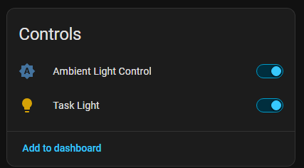
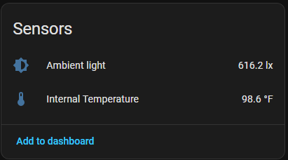
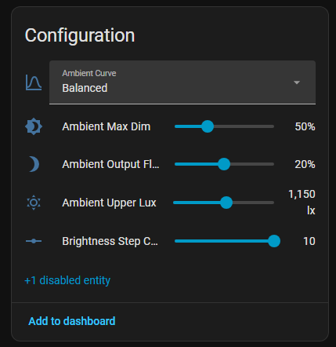
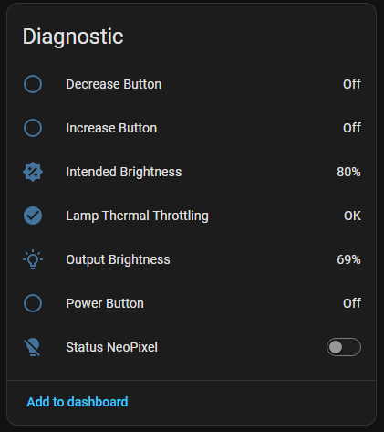

# Open Task Light for Home Assistant/ESPHome


The stock hardware for the Open Task Light can integrate with Home Assistant via ESPHome. This does require physical access to the QT Py board to re-flash with the ESPHome firmware. Once flashed, it supports over-the-air updates.   

## What you need
* Home Assistant with ESPHome configured on your network
* EspTool installed (see [Epressif docs](https://docs.espressif.com/projects/esptool/en/latest/esp32/installation.html) and the [binary releases](https://github.com/espressif/esptool/releases))
  * Once installed, make sure you can access the tool from the terminal with `esptool`
* The QT Py board, extracted from the electronics housing
* `Open-Task-Light.yaml` from these pages

## Setup OTL in ESPHome

Navigate to your Home Assistant ESPHome page and create a new device.
1. Click `Create Device`
2. Select `Empty Configuration`
3. Give your device a name. I used `Open Task Light`. This creates an `open-task-light.yaml` file for you when you click `Finish setup`.
4. Replace the placeholder contents with everything in the [`open-task-light.yaml` from this repository](open-task-light.yaml).
   
   - If you used a different name, edit the name on line 32:
```yaml
esphome:
  name: "open-task-light"
```
5. Click the `Install` button and select `Advanced options` > `Download firmware binary`. Save the **factory image** file to a convenient location.

## Flashing the ESPHome firmware for the first time
1. Connect the QT Py to your computer and note the port it's attached to. In my case this is `COM12`. 
2. Open a terminal window and enter this command, but do NOT YET press enter:  
`esptool --chip esp32s2 --port COM12 --baud 460800 write_flash 0x0 C:\otl\open-task-light-firmware.factory.bin`
3. On the QT Py: 
   1. Hold down the `boot` button.
   2. Press and release the `reset` button.
   3. Hit `Enter` on the esptool command above.
   4. Let go of the `boot` button.

The firmware should now be flashing onto the QT Py. When complete, it should become visible in ESPHome as "Online".

5. Verify OTA updates work, install the firmware again from ESPHome, but this time select "over the network".
6. Reinstall the QT Py into the electronics housing

## Using Open Task Light with Home Assistant

### Features
* Ambient Light Control
* Thermal Monitoring with power throttle
* Sensor for Internal Temperature
* Sensor for Ambient Light
  * When Ambient Light Mode is enabled, the lamp will first activate the requested brightness and then, over 1.5 seconds, lower the brightness according to the ambient light settings.
* Configurable brightness step count
* Ambient Light Controls
  * Ambient Curve options (Aggressive, Balanced, Gentle)
  * Ambient Max Dimming down from set value
  * Ambient Max Dim upper lux limit
  * Ambient Dimming output floor
* Changes to settings are saved to flash memory once per minute to avoid flash memory wearing out. 

### Physical Buttons
**Power**: Turn the lamp on and off.  
**`-`**: Decrease the brightness.  
**`+`**: Increase the brightness.  
**`-` & `+`**: Toggle Ambient Light Mode.

### Virtual Buttons
* Toggle the light on/off and set the light brightness
* Toggle Ambient Light Control
* Brightness Step Count (between 4 and 10) to control the steps to go from minimum to maximum brightness.

### Diagnostics
* Physical button input detections
* Intended brightness
* Output brightness (when Ambient Light Mode is enabled)
* Thermal Throttling Status. If active, a warning state is published to Home Assistant.


## Open Task Light Panels







